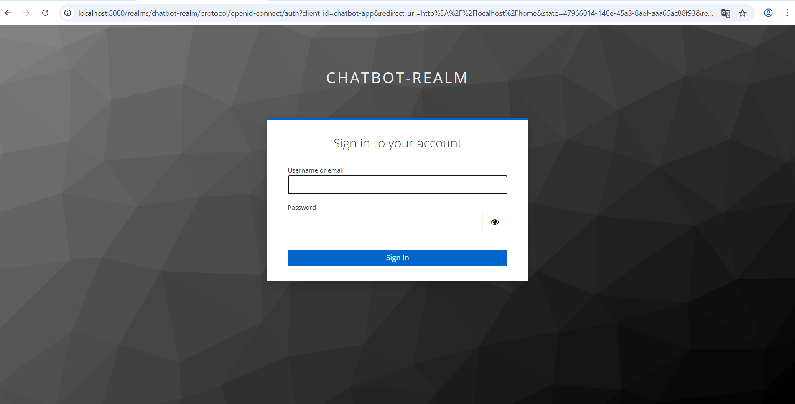
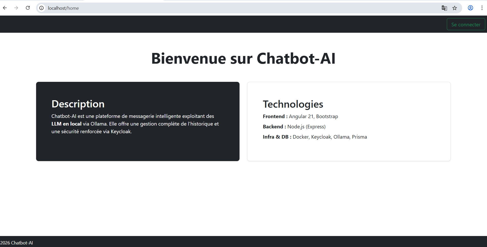
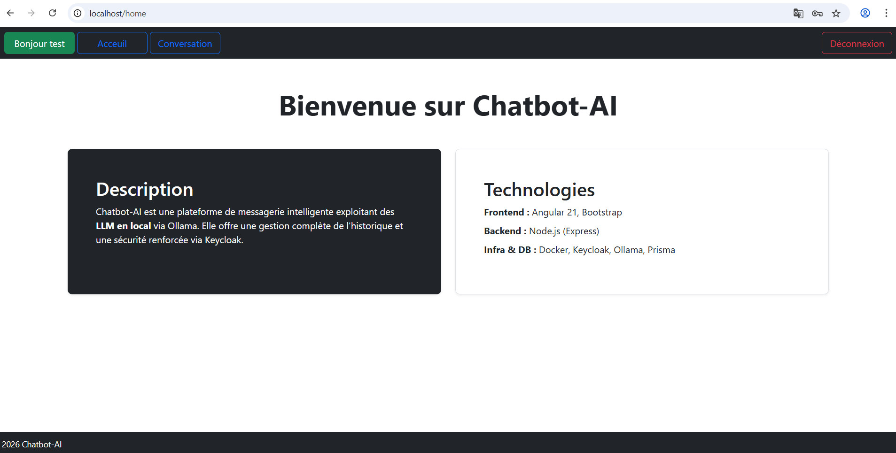
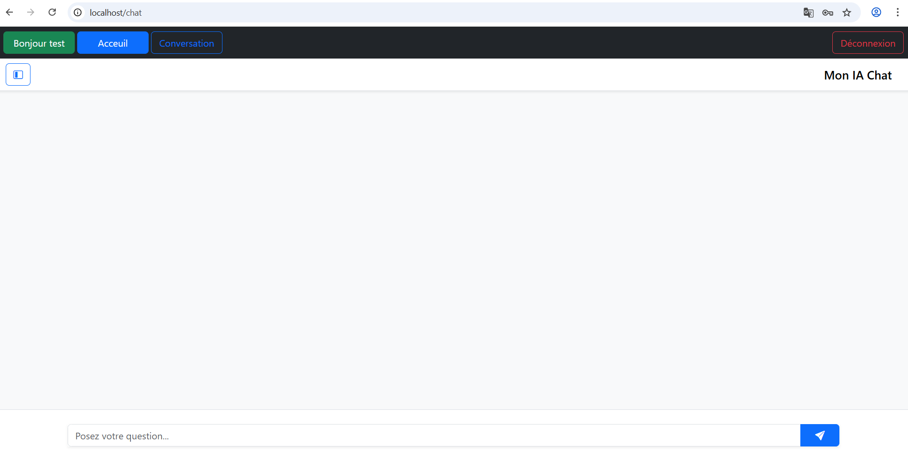
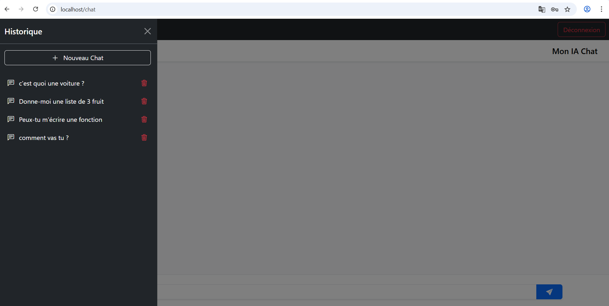
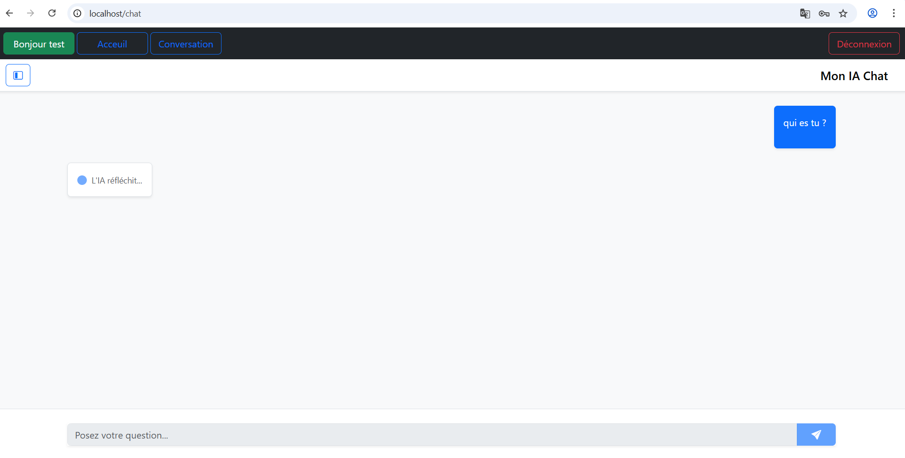
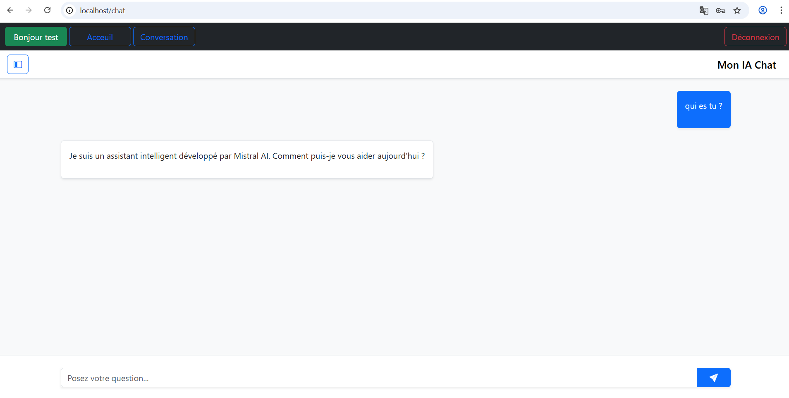

# Chatbot-AI

## Overview

Chatbot-AI is a Minimal Viable Product (MVP) of a conversational web application powered by an LLM (Mistral).

The application allows authenticated users to interact with an AI chatbot, manage their conversation history, and securely access their data using Keycloak-based authentication.

---

# Demo Video

🎥 Full application demonstration:

[Watch the demo on YouTube](https://youtu.be/13nnK8rFUvw)

---

# Features

## Application Preview

Here are some screenshots of the Chatbot-AI MVP in action:

### Login with Keycloak


### Home


### User Home


### Chat


### Chat history


### Chat with Mistral 






# Authentication
- JWT-based authentication with Keycloak

# AI Chat
- Real-time chat interaction with a Mistral LLM

# Conversation History

- View past conversations
- Delete conversations

# Dockerized Environment
- Keycloak and PostgreSQL run via Docker Compose
 
# Tech Stack
 
# Backend
- Node.js / Express.js
- Prisma ORM
- PostgreSQL
 
# Frontend
- Angular 21
- Bootstrap 5
 
# Authentication
- Keycloak
- JWT
 
# Infrastructure
- Docker
- Docker Compose

---

# Architecture Overview

```txt
Chatbot-AI/
├── backend/
│   ├── config/
│   ├── controllers/
│   ├── middlewares/
│   ├── routes/
│   ├── services/
│   └── validators/
│
└── frontend/
    └── src/
         └──app/
           ├── core/
           ├── feature/
           └── shared/

```

Backend follows a layered architecture (controllers → services → database)

Frontend follows Angular modular architecture (core, shared, feature-based modules)

---

# Setup Instructions
🔹 Prerequisites

Node.js ≥ 18

npm ≥ 9

```bash
Docker & Docker Compose
🔹 Clone the repository
git clone https://github.com/Sandirane/Chatbot-AI.git
cd Chatbot-AI

🔹 Start services 
docker-compose up --build
```
---

# Access URLs

| Service  | URL                                            |
| -------- | ---------------------------------------------- |
| Frontend | [http://localhost](http://localhost)           |
| Keycloak | [http://localhost:8080](http://localhost:8080) |

---

# Author

Created by **Sandirane**  
[GitHub Profile](https://github.com/Sandirane)
